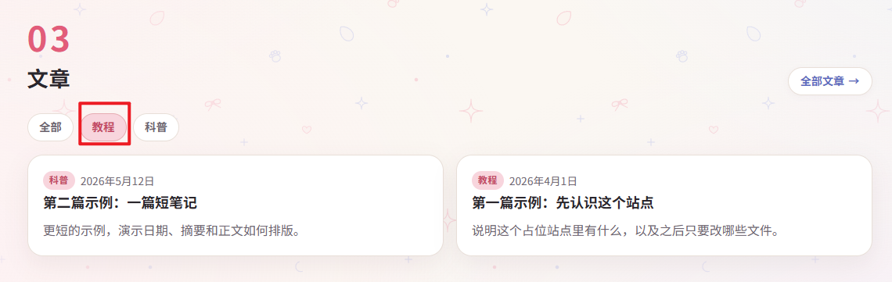
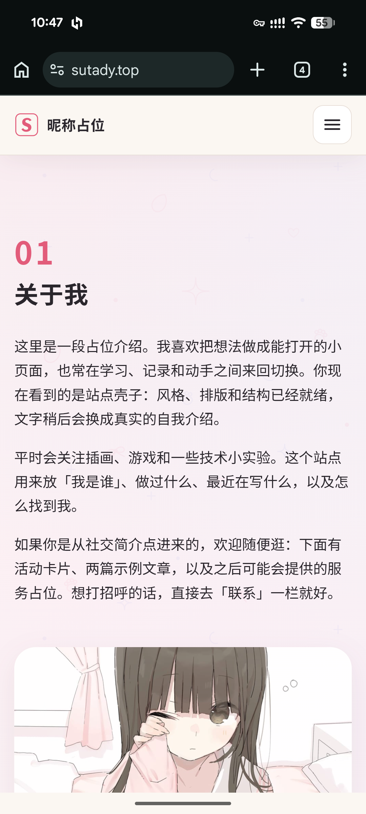
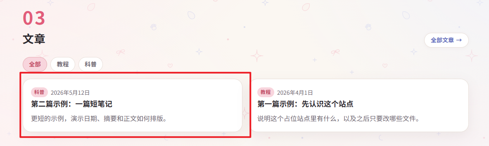
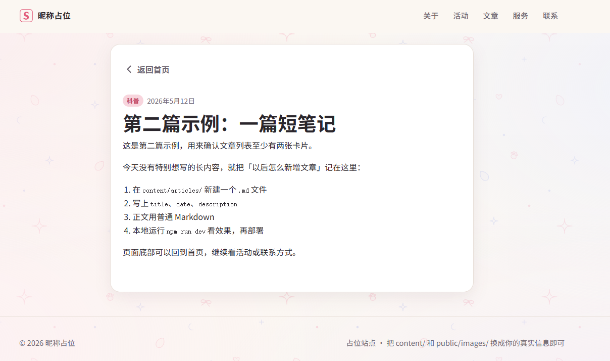

# Updata-V7

## 文章模块问题

我这里点击了筛选成教程类文章，但是没有变化是因为这个筛选功能还没有实现吗？还是bug呢？

## 背景问题

关于背景图案问题。手机端上的背景图案好像太淡了，基本看不见。

PC端还好，没什么大问题。

好像是放大后的问题？因为在pc端100%尺寸显示还正常，使用250%尺寸放大后就图标就变得很淡了，基本看不见了。

## 头像设置

帮我把头像换成/image/avatar_square.jpg或者avatar.jpg

## UI/加载 优化

我现在点击一片笔记是直接加载到了一个新的网页

能不能变成一种“软加载”呢？例如通过书本翻页的形式，软加载到这个文章页面呢？

还有就是如果我有多篇文章的话，我感觉可以在文章的页面多一个文章之间的跳转功能，不然每次都要跳转到首页去找文章感觉不是很合理。 

## 图标设置

我感觉现在网站的图标是粉色的“S”不是很好看，能不能替换成image/Hello.jpg呢？