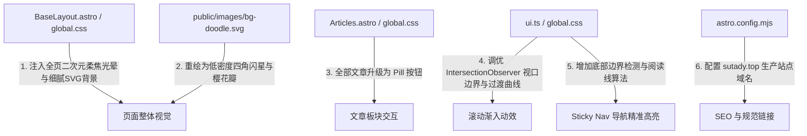

# 个人网站 UI、交互动画与页面视觉升级方案 (v5)

## [Goal Description]
本项目目前基于 Astro 7 构建为纯静态网站，托管于 Cloudflare Pages 并绑定域名 `sutady.top`。基础架构和内容体系已完整运行，当前需要依照 `updata_plan/fix-plan-v5.md` 解决 UI 氛围感、交互动画与导航高亮等问题：
1. **背景气质转换**：将原有类似 Telegram 密集办公杂物线条的聊天墙纸，替换为**通透、温柔的二次元少女站氛围**（多点柔光网格渐变 + 极淡樱花/闪烁星芒矢量微纹理，卡片实色对比分明）。
2. **「全部文章」按钮化**：将首页文章区右上角的弱可感知纯文本链接，升级为具备清晰交互形态的胶囊药丸按钮（Pill Button）。
3. **滚动渐入动效（Scroll Reveal）调优**：实现轻量原生、下拉时平滑浮现的视觉效果（350–400ms，克制位移，无障碍自适应，首屏无闪烁）。
4. **Sticky Nav 高亮定位修复**：彻底解决滚动到 `#connect`（联系我）时导航高亮锁死在「服务」的问题。
5. **基础配置完善**：在 `astro.config.mjs` 中补齐 `site: 'https://sutady.top'` 规范域名，完善分类筛选空状态友好展示。

---

## User Review Required

> [!IMPORTANT]
> **背景视觉风格确认**：
> 全新二次元背景由两层构成：
> 1. **CSS 固定柔焦环境光晕（Ambient Mesh/Radial Glow）**：在页面背景融入温暖米白（`#fcf8f5`）、淡樱粉（`#fbe8ee`）与薰衣草淡紫（`#edf0fc`）的极淡光晕。
> 2. **精致二次元矢量小图案（Anime Motif SVG）**：替换原本的 30+ 种密集生活杂物图案，采用低密度、低透明度的四角闪耀星点（キラキラ）、飘落樱花瓣与梦幻十字星尘，平铺在 480×480 空间中，绝不干扰文字阅读。
> 所有卡片保持高对比白底实色，既梦幻又清晰。

> [!NOTE]
> **动效技术方案**：
> 采用 **纯原生 CSS + IntersectionObserver**，零外部重量级依赖，打包体积保持最小，秒开性能不受任何影响。

---

## Open Questions

目前暂无阻塞性疑问。如果您对背景图案的元素有特定喜好（例如希望增加特定的装饰或特定色系），可在审批时留言备注。

---

## Proposed Changes



<br/>

### 1. 静态资源与背景矢量组件 (Public Assets)

#### [MODIFY] [public/images/bg-doodle.svg](file:///home/sutady/PersonalWeb/public/images/bg-doodle.svg)
- 清理密集的飞机、手柄、便签、咖啡杯等聊天壁纸元素。
- 重构为精致二次元少女风格图案：四角芒星（Sparkle 4-point star）、微风樱花瓣（Sakura petal）、星尘微十字（Twinkle cross）、柔和缎带（Ribbon）。
- 画布扩大至 480x480，间距拉大，透明度调整至轻柔的 `0.18 ~ 0.25`，确保背景若隐若现、空灵通透。

---

### 2. 全局样式表与视觉系统 (Styles)

#### [MODIFY] [src/styles/global.css](file:///home/sutady/PersonalWeb/src/styles/global.css)
- **全局背景改造**：
  - 更新 `.page-bg`，采用 `fixed` 背景附件，叠加多层平滑辐射渐变（奶油色、淡樱花粉、浅薰衣草紫），形成二次元光晕基底。
  - 叠加上述优化后的二次元轻量微图案。
  - 确保各区块（Hero、About、Projects、Articles、Services、Connect）在缝隙处显露光感，同时内部卡片纯色实底。
- **「全部文章」控件按钮化**：
  - 改造 `.section-more`：
    ```css
    .section-more {
      display: inline-flex;
      align-items: center;
      gap: 0.35rem;
      min-height: 36px;
      padding: 0.32rem 0.95rem;
      border-radius: 999px;
      border: 1px solid var(--line);
      background: var(--surface);
      color: var(--accent-2);
      font-weight: 600;
      font-size: 0.88rem;
      text-decoration: none;
      box-shadow: 0 2px 8px rgba(90, 50, 70, 0.04);
      transition: all 0.2s ease;
    }
    .section-more:hover {
      border-color: var(--accent);
      color: var(--accent-deep);
      background: var(--accent-soft);
      transform: translateY(-1px);
    }
    ```
- **滚动渐入动效（Scroll Reveal）CSS 细化**：
  - 调优 `.reveal` 与 `html.js .reveal.is-visible`：
    - 位移缩减为克制的 `14px`。
    - 动画时长调整为 `0.38s`，曲线采用 `cubic-bezier(0.16, 1, 0.3, 1)`，体现轻巧干脆的微动画感。
    - 保留并确保 `@media (prefers-reduced-motion: reduce)` 完全瞬时显示。

---

### 3. 组件微调 (Components)

#### [MODIFY] [src/components/Articles.astro](file:///home/sutady/PersonalWeb/src/components/Articles.astro)
- 为右上角「全部文章」增加箭头暗示，例如 `全部文章 →`，进一步强化可点击交互提示。

---

### 4. 客户端交互脚本与导航高亮 (Scripts)

#### [MODIFY] [src/scripts/ui.ts](file:///home/sutady/PersonalWeb/src/scripts/ui.ts)
- **修复 Sticky Nav 高亮停在「服务」的问题**：
  - 重写 `initScrollSpy`：
    1. **底部边界保护**：每次滚动检测 `window.innerHeight + window.scrollY >= document.documentElement.scrollHeight - 40`。当用户滚至页面底部时，直接激活最后一个导航项（`connect`），解决因为页面触底、交叉面积不足导致的停滞问题。
    2. **视口阅读线判定**：对所有锚点 section 根据视口相对位置（`getBoundingClientRect().top`）进行排序判定，以顶栏高度 + 偏移（如 100px）作为基准，精准切换当前激活区。
- **调优 `initReveal` 滚动渐入触发时机**：
  - 将 `rootMargin` 从 `0px 0px 20% 0px`（提前过早触发，导致用户还没滚到就播放完毕）调整为 `0px 0px -30px 0px`。
  - 首屏检测：初次加载时立即检查视口内已有元素并赋予 `.is-visible`，避免首屏内容刷新时出现白屏或闪烁。

---

### 5. 配置文件 (Config)

#### [MODIFY] [astro.config.mjs](file:///home/sutady/PersonalWeb/astro.config.mjs)
- 补充生产域名配置：
  ```js
  export default defineConfig({
    site: 'https://sutady.top',
    prefetch: true,
  });
  ```

---

## Verification Plan

### Automated Tests
1. **构建校验**：
   ```bash
   npm run build
   ```
   验证所有 5 个静态路由生成正常，TypeScript 编译零报错，无坏链与资源加载异常。

### Manual Verification
1. **背景气质验证**：
   - 本地运行 `npm run preview` 或 `npm run dev`，打开浏览器查看整体页面。
   - 验证：背景不再是杂乱的办公/生活 emoji 贴图，呈现清透柔和的日系少女风渐变与微芒星花图案，且卡片正文依然清晰易读。
2. **「全部文章」按钮验证**：
   - 检查文章区块右上角，确认呈现精致描边药丸按钮外观。
   - 悬停（Hover）及聚焦（Tab 键）测试状态变化。
3. **滚动渐入动效验证**：
   - 缓慢向下滚动页面，各板块与卡片依次伴随轻微上浮（约 14px）与透明度渐入。
   - 刷新页面，确认首屏（Hero 与首个板块）立即正常展现，无空白闪烁。
4. **Sticky Nav 高亮验证**：
   - 从顶部一路滚动到底部 `#connect`（联系我）。
   - 确认当到达底部联系区域时，顶栏导航准确高亮「联系」，不再误停留在「服务」。
   - 点击各锚点导航跳转，确认滚动与对应高亮均精准匹配。
