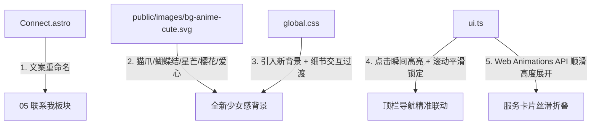

# PersonalWeb 体验优化与交互动画方案 (v6)

## [Goal Description]
根据 `updata_plan/update-v6.md` 的反馈与截图分析，当前网站需要针对视觉可爱度、导航跳转联动、折叠交互动画以及联系人板块文案进行精准优化：
1. **背景彻底可爱化（真正二次元少女感）**：彻底清除任何公文包、笑脸、杂乱线条。重新设计极具少女萌感的矢量图案（肉垫猫爪 🐾、梦幻蝴蝶结 🎀、闪烁星芒 ✨、飘散樱花瓣 🌸、软萌小爱心 💖），并使用全新的独立资源命名（`bg-anime-cute.svg?v=6`）彻底消除客户端强缓存。
2. **修复顶栏点击跳转高亮卡死问题**：解决在「关于」点击「活动」或「文章」跳转后顶栏仍然停留在「关于」的 Bug。实现点击**瞬间切色**与平滑滚动期间的判定锁定。
3. **服务折叠平滑过渡动画**：告别 `<details>` 展开/收起的原生生硬跳跃，基于 Web Animations API 实现带弹性缓动曲线（`cubic-bezier(0.16, 1, 0.3, 1)`）的高度自适应渐入展开与平滑收起。
4. **联系我文案定制**：
   - 「即时通讯」→「社交账号」
   - 「社交」→「海外账号」
   - 「邮箱与开发」→「其他方式」

---

## User Review Required

> [!IMPORTANT]
> **关于背景图生效机制（解决此前看到旧图的问题）**：
> 此前截图（`image-20260906102842741.png`）中依然能看到旧的公文包/笑脸图案，是因为浏览器对 SVG 静态资源进行了强缓存。本次将采用全新文件名 `public/images/bg-anime-cute.svg` 并附带版本号 `?v=6`，彻底杜绝本地缓存问题，确保你刷新后立即看到全新可爱的少女系背景。

> [!NOTE]
> **交互动画性能保证**：
> 服务卡片的平滑展开采用浏览器原生的 Web Animations API，只在折叠框内部执行硬件加速的高度与透明度动画，零引入外部笨重库，保持网站极致轻巧秒开。

---

## Open Questions

目前各项需求均清晰明确，无未决疑问。

---

## Proposed Changes



<br/>

### 1. 静态资源与背景 (Assets)

#### [NEW] [public/images/bg-anime-cute.svg](file:///home/sutady/PersonalWeb/public/images/bg-anime-cute.svg)
- 创建全新超绝可爱风格矢量平铺图案（520×520 大画布，低对比，极轻柔马卡龙樱粉 `#f28da4` 与仙女紫 `#8c99e6`，透明度 `0.20 ~ 0.25`）：
  - **软萌猫肉垫爪爪（Cute Cat Paws）**
  - **少女飘带蝴蝶结（Ribbon Bows）**
  - **日系闪耀星芒（Kirakira 4-point Sparkles）**
  - **柔美五瓣樱花与飘散花瓣（Sakura Blossoms & Petals）**
  - **软圆爱心与微星点（Chubby Hearts & Twinkle Dots）**
  - 绝对无公文包、便签、笑脸、飞机等杂乱办公/生活线条。

---

### 2. 全局样式 (Styles)

#### [MODIFY] [src/styles/global.css](file:///home/sutady/PersonalWeb/src/styles/global.css)
- **更新背景引用**：
  将 `.page-bg` 的背景图切换为 `url("/images/bg-anime-cute.svg?v=6")`，确保浏览器立即抓取新图案。
- **导航项动效**：
  为 `.nav a` 增加颜色与背景平滑过渡 `transition: color 0.2s ease, background-color 0.2s ease;`。
- **服务卡片折叠指示图标动效**：
  为 `summary::after` 增加展开/闭合的平滑旋转动效。

---

### 3. 组件文案 (Components)

#### [MODIFY] [src/components/Connect.astro](file:///home/sutady/PersonalWeb/src/components/Connect.astro)
- 修改 `groups` 配置：
  ```diff
   const groups: { id: SocialGroup; title: string }[] = [
  -	{ id: 'im', title: '即时通讯' },
  -	{ id: 'social', title: '社交' },
  -	{ id: 'dev', title: '邮箱与开发' },
  +	{ id: 'im', title: '社交账号' },
  +	{ id: 'social', title: '海外账号' },
  +	{ id: 'dev', title: '其他方式' },
   ];
  ```

---

### 4. 交互逻辑 (Scripts)

#### [MODIFY] [src/scripts/ui.ts](file:///home/sutady/PersonalWeb/src/scripts/ui.ts)
- **彻底修复顶栏跳转高亮未切问题**：
  1. **点击即刻切换**：在 `links` 点击事件中，点击后直接调用 `setActive(targetId)`，不需要等待页面漫长的滚动结束，上方的重点色即刻点亮！
  2. **滚动期间防抖锁定**：在点击触发滚动期间设置一个短暂的锁定锁（例如 800ms），避免在穿过中间的「关于」或页面顶部时被滚动监听误切回去。
  3. **精确阅读线算法**：校准普通滚动时的视口判定，让各个 section 的切换顺畅自然。
- **实现服务卡片「展开说明」丝滑交互动画**：
  添加 `initDetailsAnimation` 函数：
  - 监听 `<summary>` 点击事件并阻止原生瞬间硬展开；
  - 展开时：设置 `open` 属性，通过 Web Animations API 让内部容器从 `height: 0, opacity: 0` 平滑展开至 `height: targetHeight, opacity: 1`（时长 300ms，缓动 `cubic-bezier(0.16, 1, 0.3, 1)`）；
  - 收起时：从当前高度平滑折叠至 0，动画完成后移除 `open`。

---

### 5. 说明文档 (Docs)

#### [MODIFY] [README.md](file:///home/sutady/PersonalWeb/README.md)
- 更新联系人分组说明与背景资源说明，保持文档与最新代码一致。

---

## Verification Plan

### Automated Tests
1. **构建校验**：
   ```bash
   npm run build
   ```
   验证静态 HTML 生成无报错，TypeScript 检查通过。

### Manual Verification
1. **可爱背景检查**：
   - 打开浏览器，检查背景是否为干净纯粹的猫爪、蝴蝶结、樱花瓣和闪光星芒，无任何杂乱异形物品。
2. **顶部导航跳转检查**：
   - 处于「关于」时，点击「活动」，确认顶栏的高亮立即丝滑切至「活动」，并伴随页面平滑滚动至活动模块。
   - 点击「文章」、「服务」、「联系」，确认每个标签都能精准、瞬间点亮并正确导航。
3. **服务展开折叠动效检查**：
   - 点击服务卡片的「展开说明」，观察内容是否如同卷轴般顺畅淡入滑下，再次点击是否平滑向上收回。
4. **文案检查**：
   - 滚动到第 05 部分，确认标题分别为「社交账号」、「海外账号」和「其他方式」。
