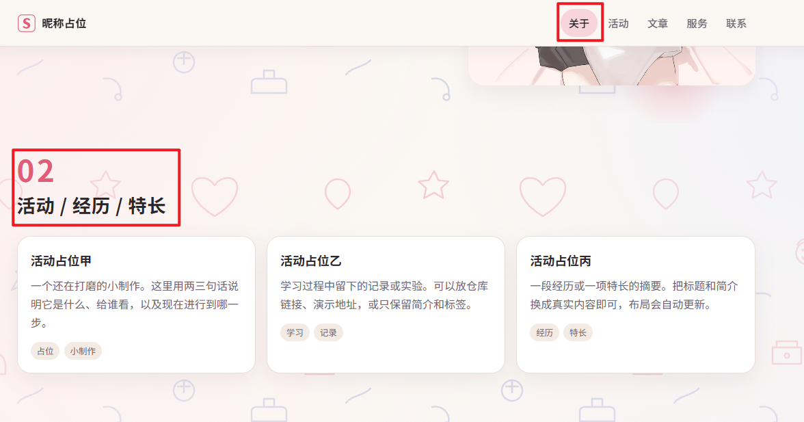
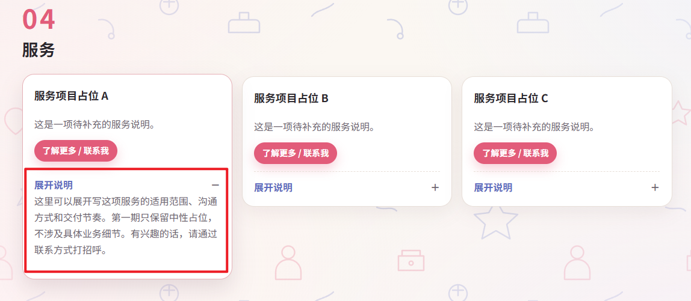

# update-v6

我说几个我感觉有问题的地方。

## 背景问题

背景图案都不可爱啊。又是笑脸，又是人物，又是公文包和一些乱七八糟的东西。感觉很奇怪。

## 顶部跳转问题

如图。我明明在活动页面，但是顶部却是显示“关于”标签。

具体情况是：我在“关于”页面上，点击了“活动”按钮，然后确实跳转到了活动模块，但是上方的重点色依旧是“关于”。

从“活动“跳转到“文章”也是一样的效果。

## 交互动画

我在想能不能优化一下交互，点击和滑动的动画效果呢？

1. 例如在“服务”页面我点击了一下展开说明，只是很生硬的卡片立刻展开。

## 文案标签修改

在05联系我中。
把“即时通讯”修改成“社交账号”
把“社交”修改成“海外账号”
把“邮箱与开发”修改成“其他方式”